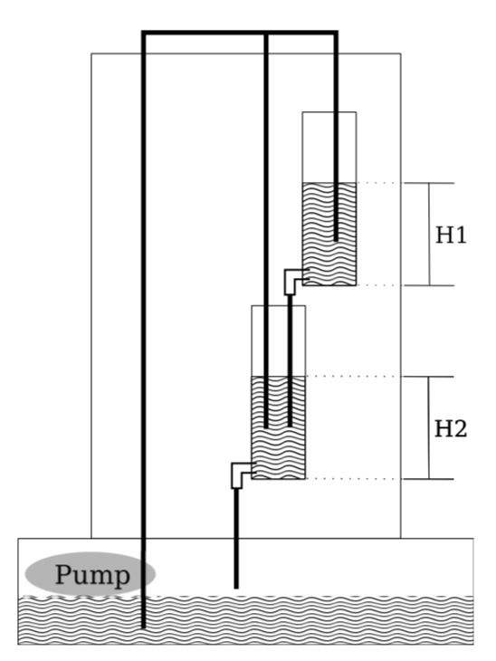
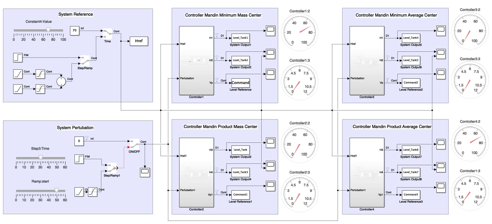

# Fuzzy Control System for a Liquid Level System

  

## Dashboard

  

## System Equations

## Requirements

- git
- [MATLAB]()
- [SIMULINK]()

## License

fuzzy_control package is open-sourced under the GNU General Public License v3.0. See the
[LICENSE](LICENSE) file for details.
